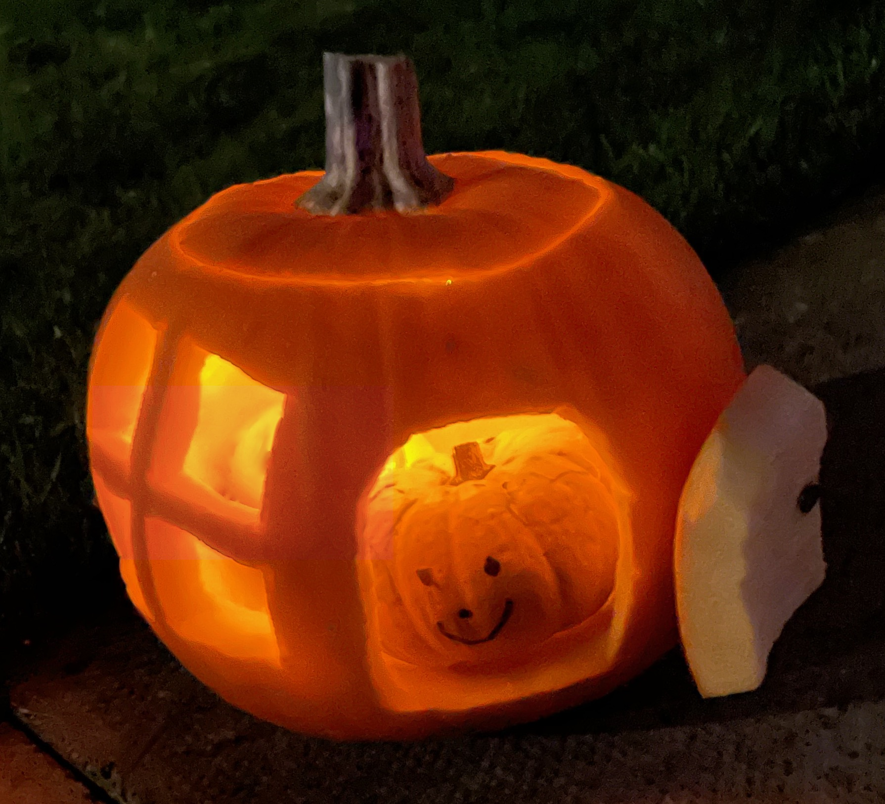

## Data Analysis Portfolio

### Hospital Care in Scotland - Impact of Covid-19 and Winter

[Hospital Care in Scotland - Impact of Covid-19 and Winter]()

Background to Project
This was a group project carried out over seven days. The brief was to investigate to what extent the ‘winter crises’ reported in the media are real and determine how Covid has affected acute care in Scotland. The findings were presented via an R Shiny dashboard and presentation.

The dashboard outlines the topic in terms of a journey through the hospital system from admission, to treatment and then finally discharge. It contains a front page summary which also allows data to be investigated by health board, followed by further tabs which cover admission, treatment and discharge. A tab for statistical analysis of the winter/summer difference is also included.

Names of Group Members
Fiona Carson, Sarah Hughes and Malcolm Speight

Stages of the Project
A large amount of background reading was conducted at the start of the project to help with the questions in the brief. Crises in the NHS is topical at the moment and there are a large number of media reports available.

The data links provided in the brief were investigated and other data was also sourced from the Public Health Scotland website. This stage of the project involved high level analysis such as determining what variables were in the data and what time periods the data was collected over.

The git folder structure was set up and the repository shared.

Once the data was better understood we discussed the key datasets that would help answer the brief. These key datasets were divided among team members and then analysed in detail to determine trends in time and by geography, age and deprivation.

Planning the structure of the dashboard was conducted on pen and paper. Once this was agreed, a more detailed dashboard outline was created and shared through Miro.

Cleaning and wrangling the data was a time consuming task, which was followed by preparing suitable graphs. Getting the datasets into standard formats where possible was important to help make the dahsboard buil smoother. A graph theme, colour palette and plotting function were created to simplify the visualisation step and ensure our plots were consistent.

The outline of an R Shiny app was created and then populated according to the original plan.

It was difficult to visualise the contents of our front page summary tab at the start of the project so this was designed and built after the rest of the app was working.

The app was extensively tested to ensure it worked as it should and all data was displayed as expected.

Finally the documentation was completed and a presentation prepared.

Ethical Considerations
Some of the datasets had flags for confidentiality, meaning that values were low enough that they could identify and individual. This meant that patient numbers are underestimated in some of teh health boards with lower patient numbers. To limit the effect that this would have we imputed missing values as 1 (making the assumption that at least one patient was there), but only in cased were we were aggregating further. Once aggregated there are no further issues with confidentiality.

There are some ethical considerations around publishing waiting time data. As described in the data bias section different waiting times will be calculated depending on whether you use the completed or patients still waiting datasets. This could lead to patients having unrealistic expectations for how quickly they will be seen for a particular condition.

  

  
  

---
### Density of Juvenile Salmon in Caithness Rivers

[Link to R Shiny app](https://e4z4az-fiona-carson.shinyapps.io/fish_dashboard/)

Background  
How was the data gathered?  
Information on the density of juvenile salmon was collected by a method called electrofishing. Various sites across six Caithness rivers were monitored over a range of years. The practicalities of these measurements involve either a bank-based generator and control box or equipment in a portable backpack format. The volume of the area of river tested must be estimated to allow the calculation of both mass and numerical densities.

Why was the data gathered?  
The National Electrofishing Programme for Scotland (NEPS) is organised, run and reported on by Marine Scotland Science (MSS) and operates across Scotland; its purpose is to provide regional assessment of the status of juvenile salmon throughout Scotland. The Caithness District Salmon Fisheries Board (CDSFB) is responsible for collecting the data for NEPs from the Caithness rivers and they also sample sites which are outwith the NEPs programme. CDSFB are concerned with surveillance of the juvenile salmon stocks in each of the six Caithness rivers to enable advice to be provided to fisheries managers.

Motivation for Creating R-shiny Dashboard  
Initially a Tableau dashboard was created with this data. After learning R Shiny I wanted to practice creating dashboards and felt that this dataset was ideal as it contained data which could be visualised both graphically and geospatially.

   

                                                                

---
### Incidence of Cancer in NHS Borders
[Incidence of Cancer in NHS Borders - Markdown Report](/html_files/cancer_incidence_data_investigation.html)

The incidence of cancer in NHS Borders was investigated to help inform planning for the future provision of cancer treatment services (mock task). Datasets from Public Health Scotland were cleaned, wrangled and analysed. This was conducted using R with the tidyverse package. Results of the analysis were presented to key stakeholders. 

 

Key Findings
- The population of the Borders region of Scotland is rising.
- The number of incidences of cancer in NHS Borders is also rising but at a faster rate than can be accounted for by the population increase.
- Bladder, prostrate, lung and breast cancer account of 60% of all incidences.
- A pronounced spike in the number of cancer diagnoses is observed every 3 years. Upon further analysis this spike was found to come from the breast cancer data and research indicates GP practices only take part in screening programmes every 3 years.
- 11 out of 12 of the most common cancer types have increasing numbers of incidences (only leukaemias are not increasing).

---
### Dirty Data Project
This project involves cleaning "dirty" datasets and performing analysis on the cleaned data. The main purpose is to gain experience in dealing with such datasets. The outputs of each task are a cleaning script, a cleaned dataset and a markdown document containing the results of the analysis. It should be noted that this analysis was conducted durinng week 4 of the CodeClan Data Analysis course and so the coding is at a somewhat basic level.

The work in this repository was conducted with the R programming language.

#### Boing Boing Candy  

[Boing Boing Candy - Markdown Report](/html_files/candy_analysis.html)

 

The boing boing candy dataset contains the results of a Halloween candy survey. The data covers three years (2015, 2016 and 2017) and includes information on the person completing the survey, such as age, gender and country. The ratings used were Joy, Despair, Meh or NA for the 2016 and 2017 data; Meh was not an option in 2015. The 2015 data also lacked information on the gender and country of the person completing the survey. I believe it is accurate to say the original datasets were a mess and required extensive cleaning. The country column, in particular, had a lot of non-standard answers. Some analysis was conducted on the age of participants but most of the analysis focussed on which candies were most or least popular. The items rated weren't just candy, things like DVDs, glow sticks and pharmaceuticals were also included. Limiting the analysis to just candy was considered but it was decided to leave non-candy items in for completeness.

#### Decathlon

[Decathlon - Markdown Report](/html_files/decathlon_analysis.html)

The decathlon dataset contains the results from each of the 10 events in the decathlon. The data covers two competitions - the 2004 Olympic Games and the 2004 Decastar competition. The data also includes the place the athlete finished ("rank") and their total points. This dataset only required a few relatively minor cleaning steps before it was interrogated to answer questions on longest jump, average 100 metre times, highest points total etc. This is a nice dataset which shows the dominance of three decathletes during the 2004 season.

---

Page template forked from <a href="https://github.com/evanca/quick-portfolio">evanca</a>

<!-- Remove above link if you don't want to attibute -->
