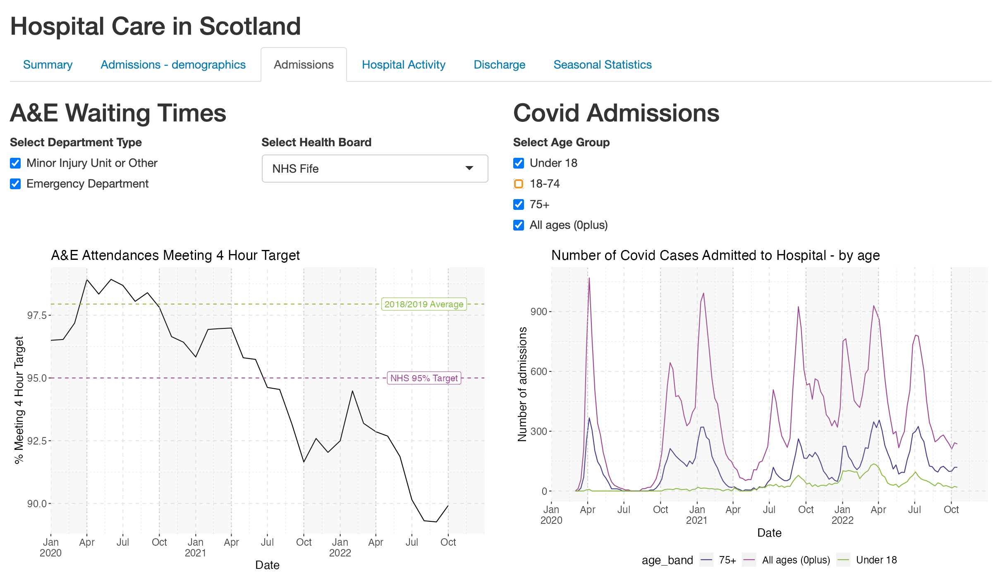
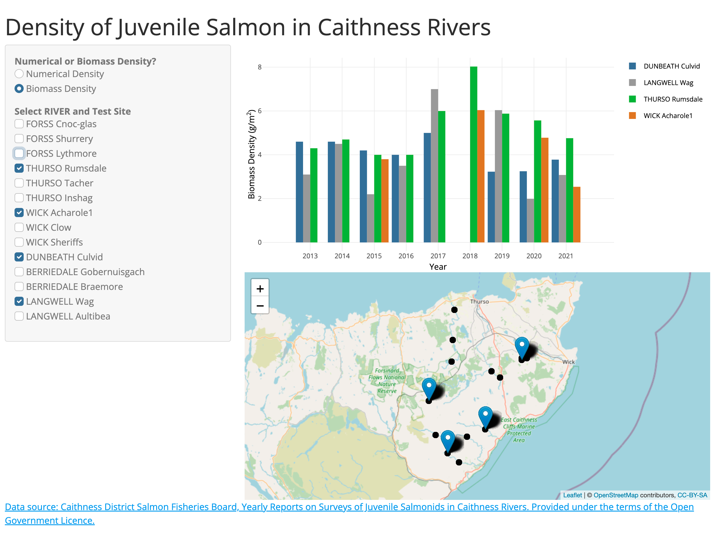
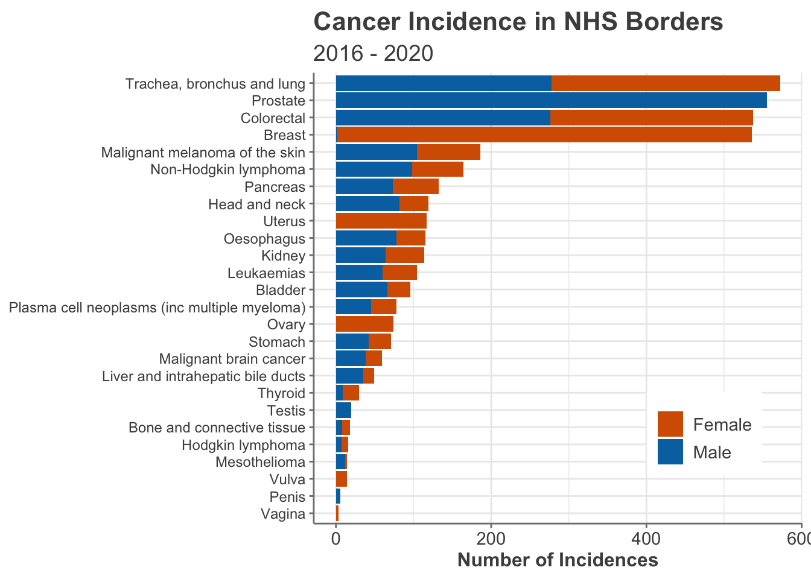

## Data Analysis Portfolio

### Hospital Care in Scotland - Impact of Covid-19 and Winter

[Hospital Care in Scotland - Impact of Covid-19 and Winter]()

asdfjksjdfklsdjfkljsdfklsdf aksldjfsk aslkjdfk. sdkfj sdlkfj sdkfj 

  

  
asdfjksjdfklsdjfkljsdfklsdf aksldjfsk aslkjdfk. sdkfj sdlkfj sdkfj 
  
  
  

---
### Density of Juvenile Salmon in Caithness Rivers

[Link to R Shiny app](https://e4z4az-fiona-carson.shinyapps.io/fish_dashboard/)

asdfjksjdfklsdjfkljsdfklsdf aksldjfsk aslkjdfk. sdkfj sdlkfj sdkfj 

  

asdfjksjdfklsdjfkljsdfklsdf aksldjfsk aslkjdfk. sdkfj sdlkfj sdkfj 

                                                                

---
### Incidence of Cancer in NHS Borders
[Incidence of Cancer in NHS Borders - Markdown Report](/html_files/cancer_incidence_data_investigation.html)

The incidence of cancer in NHS Borders was investigated to help inform planning for the future provision of cancer treatment services (mock task). Datasets from Public Health Scotland were cleaned, wrangled and analysed. This was conducted using R with the tidyverse package. Results of the analysis were presented to key stakeholders. 

Key Findings
- The population of the Borders region of Scotland is rising.
- The number of incidences of cancer in NHS Borders is also rising but at a faster rate than can be accounted for by the population increase.
- Bladder, prostrate, lung and breast cancer account of 60% of all incidences.
- A pronounced spike in the number of cancer diagnoses is observed every 3 years. Upon further analysis this spike was found to come from the breast cancer data and research indicates GP practices only take part in screening programmes every 3 years.
- 11 out of 12 of the most common cancer types have increasing numbers of incidences (only leukaemias are not increasing).

---
### Dirty Data Project

[Boing Boing Candy - Markdown Report](/html_files/candy_analysis.html)

[Decathlon - Markdown Report](/html_files/decathlon_analysis.html)

#insert photo from halloween of our pumpkins
#

---

Page template forked from <a href="https://github.com/evanca/quick-portfolio">evanca</a>

<!-- Remove above link if you don't want to attibute -->
